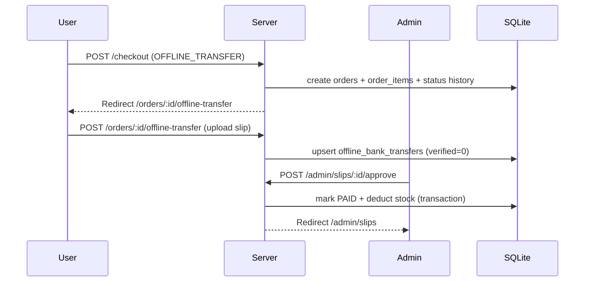
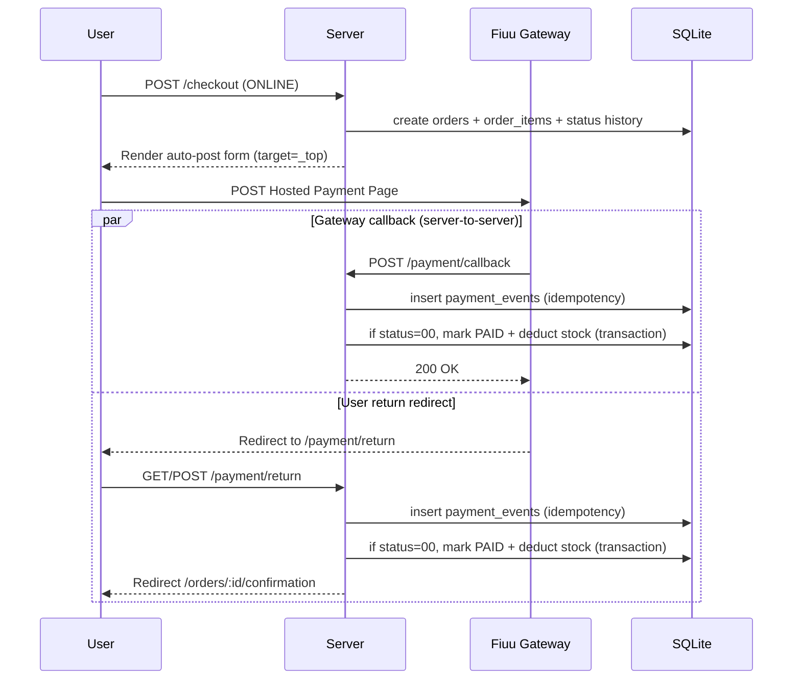

# Checkout & payment flows

## Overview

The system creates the order first, then confirms payment (online) or waits for slip verification (offline). Stock is deducted atomically only when payment is confirmed.

## Storefront → Cart → Checkout

```mermaid
flowchart TD
  A[Browse /products] --> B[Add to cart]
  B --> C[/cart]
  C --> D[/checkout]
  D -->|Place order| E[Create order + items + status history]
```

## Offline bank transfer



## Fiuu hosted payment page



## Notes

- Payment callbacks can arrive before user return; processing is idempotent.
- Replay protection is implemented via `payment_events` with a uniqueness constraint on `(provider, provider_txn_id)`.
- If a payment succeeds but stock is insufficient at confirmation time, payment is marked `PAID` but fulfilment is cancelled with a status note for manual handling.
